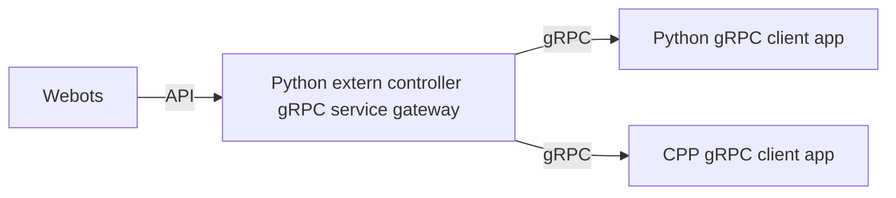

# webots-grpc

This project is a simple gateway convert from gRPC to webots socket IPC API. It follow some rules.

* extern control
* synchronous simulation



### tree

If you have no robot description file, `descriptions` folder offer some basic one.

## build

```bash
poetry run python -m grpc_tools.protoc -I ./protos --python_out=./generated --pyi_out=./generated --grpc_python_out=./generated ./protos/*.proto
```

`grpcurl -plaintext localhost:50051 list`
`grpcurl -plaintext localhost:50051 describe device.DeviceService`

### for linux

```bash
export WEBOTS_HOME=/usr/local/webots
poetry run "${WEBOTS_HOME}/webots-controller" --robot-name='Picker' ./webots_grpc/server.py
```

### for windows

If you use MSYS2 [as state](https://cyberbotics.com/doc/guide/compiling-controllers-in-a-terminal#windows), `export WEBOTS_HOME=C:\Program Files\Webots`

> I don't find out way to integrate `WEBOTS_HOME` yet

Or using poetry directly config python path,

```ini
; .env
PYTHONPATH=C:\Program Files\Webots\lib\controller\python
```


[extern controller](https://cyberbotics.com/doc/guide/running-extern-robot-controllers#launcher), e.g. 

`& "C:\Program Files\Webots\msys64\mingw64\bin\webots-controller.exe" --help`

`& "C:\Program Files\Webots\msys64\mingw64\bin\webots-controller.exe" --robot-name='IRB 4600/40' xxx.py`

`& "C:\Program Files\Webots\msys64\mingw64\bin\webots-controller.exe" --robot-name='Picker' picker_cntrl_gateway.py`

`poetry run "C:\Program Files\Webots\msys64\mingw64\bin\webots-controller.exe" --robot-name='Picker' .\webots_grpc\server.py`

`poetry run python -m tests.client`

### CPP

```bash
conan build . --build=missing -o protobuf/*:shared=False -o grpc/*:shared=False -o abseil/*:shared=False
```
